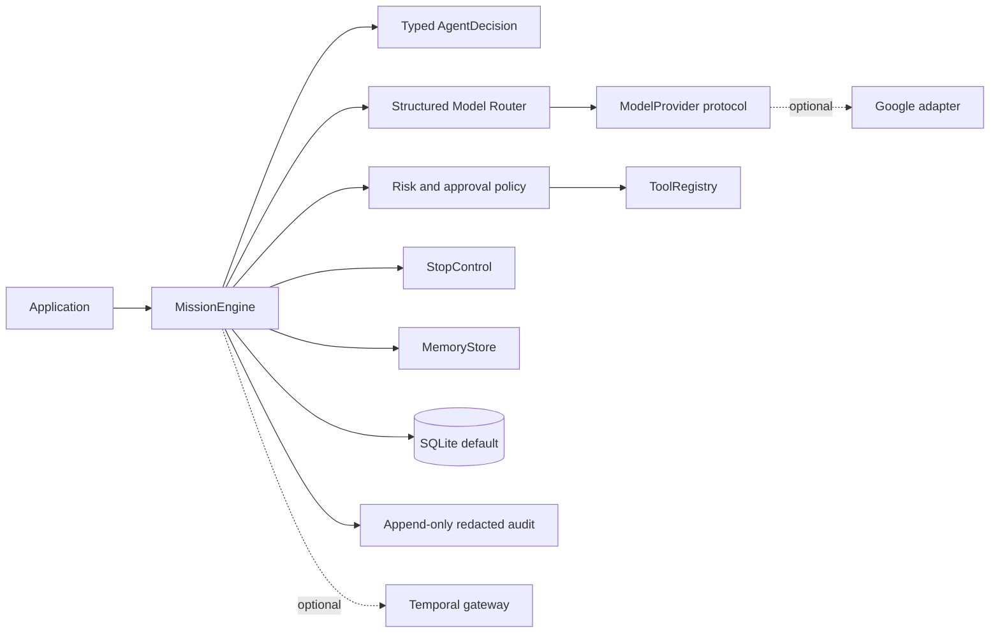

# agent-company-core

`agent-company-core` is an alpha Python framework for durable, policy-aware
multi-agent workflows. It provides reusable infrastructure for applications
that need typed decisions, persistent mission state, explicit approval
boundaries, cancellation and recovery controls, provider-neutral model
routing, memory interfaces, tool registration, and auditable execution.

It is not production-ready. The default runtime is intentionally small and
local: Pydantic contracts, SQLite, JSONL audit events, and a deterministic fake
model are enough to run the quickstart without cloud credentials.

## Architecture



The model proposes an intention; the engine validates it and applies effects
through registered interfaces. Message text is not used as a hidden business
router. Routing and delegation consume typed assessments and declared
capabilities.

## Installation

```powershell
uv venv
uv pip install -e ".[dev,app]"
```

Python 3.11 or newer is supported. The core package has only Pydantic as a
required dependency.

## Five-minute quickstart

```python
import asyncio
from pathlib import Path

from agent_company_core import MissionCreate, MissionEngine
from agent_company_core.persistence import SQLiteStore


async def main() -> None:
    engine = MissionEngine(store=SQLiteStore(Path("runtime/state.sqlite3")))
    mission = engine.create_mission(
        MissionCreate(title="First mission", objective="Complete a harmless example")
    )
    result = await engine.run_mission(mission.id)
    print(result.status, result.summary)


asyncio.run(main())
```

This uses `FakeModel`, so it needs no API key and performs no external action.
The SQLite file, `stop.json`, and `audit.jsonl` are durable across process
restarts. For a small HTTP reference app, run:

```powershell
./start.ps1
Invoke-RestMethod http://127.0.0.1:8000/health
./stop.ps1
```

The reference app is a development example, not a production deployment.

## Core capabilities

- Typed mission lifecycle and append-only mission events.
- Idempotent mission creation and durable checkpoints.
- Capability-based neutral agent registry with risk ceilings.
- Provider-neutral async model and embedding protocols, plus a fake provider.
- Deterministic risk policy and approvals that must match the requested effect.
- Persistent STOP state checked before model and tool effects.
- SQLite memory implementation behind a replaceable `MemoryStore` interface.
- Tool registry with explicit capabilities, handlers, risk metadata, and STOP checks.
- Recursive secret redaction before JSONL audit persistence.
- Experimental restricted local skill runner, disabled and untrusted by default.

## Optional integrations

Install only what an application needs:

```powershell
uv pip install -e ".[google]"     # Google Gen AI adapter
uv pip install -e ".[temporal]"   # Temporal client gateway
uv pip install -e ".[postgres]"   # SQLAlchemy/asyncpg extension point
```

The integrations are optional and are not needed by the test suite. The Google
adapter requires credentials supplied by the host application; credentials
are never included in this repository.

## Development

```powershell
uv pip install -e ".[dev,app]"
python -m pytest
ruff check src tests
mypy src
python -m build
```

See [SECURITY.md](SECURITY.md), [CONTRIBUTING.md](CONTRIBUTING.md), and
[ROADMAP.md](ROADMAP.md) for current boundaries and unfinished work.
