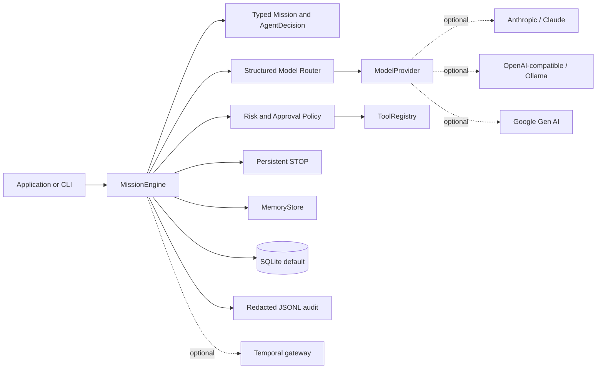

# agent-company-core

[](https://pypi.org/project/agent-company-core/)
[](https://pypi.org/project/agent-company-core/)
[](https://github.com/Nhaooo/agent-company-core/actions/workflows/ci.yml)
[](LICENSE)

`agent-company-core` is an alpha Python framework for durable, policy-aware
multi-agent workflows. Bring your own model, create a persistent mission, and
keep model decisions separate from the effects an application is allowed to
apply.

> **Alpha software:** the API is useful for prototypes and internal tools, but
> it is not production-ready. Threat-model your application before using
> sensitive data or consequential effects.

## 30-second demo

The fastest path needs no account, API key, Docker, database server, or network
call:

```powershell
python -m pip install agent-company-core
agent-company demo
```

The deterministic demo creates a durable mission, delegates by capability,
runs a typed FakeModel decision, reopens the SQLite state, records redacted
audit events, and pauses at approval and STOP boundaries.

```text
1. created durable mission       status=received
2. delegated by capability        agent=researcher
3. FakeModel typed decision       status=completed
4. redacted audit trail           events=6
5. reopened persistent state      status=completed
6. human approval boundary        status=waiting_approval
7. persistent STOP boundary       status=stopped
Demo complete: offline, deterministic, no credentials or network.
```

## Why it exists

Agent applications need more than a model call: they need state that survives
restarts, explicit approval for sensitive effects, predictable recovery, and a
record of what actually happened. The core stays provider-neutral so an
application can use a fake model locally, an optional hosted provider, or a
local OpenAI-compatible server without changing mission contracts.

## Architecture



The model proposes a typed intention. `MissionEngine` validates that
intention, checks STOP and policy boundaries, and applies effects only through
registered interfaces. Message text is not a hidden business router.

## Core capabilities

- Durable SQLite missions, append-only mission events, checkpoints, and
  idempotency keys.
- Capability-based agent selection and delegation with declared risk ceilings.
- Provider-neutral asynchronous model and embedding protocols.
- Typed decisions with structured-output validation and explicit model fallback.
- Exact-match human approvals for high-risk or explicitly sensitive actions.
- Persistent STOP state checked before model and tool effects.
- Replaceable memory and tool interfaces, plus recursive audit redaction.
- Offline deterministic `FakeModel` and a small `agent-company` CLI.

## Providers

| Provider | Adapter | Install extra | Structured decisions | CI mode |
| --- | --- | --- | --- | --- |
| FakeModel | built in | none | Pydantic validation | deterministic |
| Anthropic Claude | `AnthropicModel` | `anthropic` | JSON + Pydantic validation | mocked |
| OpenAI-compatible | `OpenAICompatibleModel` | `openai` | JSON + Pydantic validation | mocked |
| Google Gen AI | `GoogleModel` | `google` | SDK parsed response | mocked boundary |
| Ollama/local | OpenAI-compatible adapter | `openai` | JSON + Pydantic validation | mocked |

Provider SDKs are optional. Model identifiers are configuration, not package
defaults. For example, Anthropic currently documents `claude-sonnet-4-6` as an
active model, but applications should check the provider catalog before
deploying. See the [provider matrix](docs/providers.md),
[Anthropic guide](docs/providers/anthropic.md), and
[OpenAI-compatible guide](docs/providers/openai-compatible.md).

## Installation and first mission

```powershell
python -m pip install agent-company-core
agent-company run "Review a harmless local note"
```

For a library application:

```python
import asyncio
from pathlib import Path

from agent_company_core import MissionCreate, MissionEngine
from agent_company_core.persistence import SQLiteStore


async def main() -> None:
    engine = MissionEngine(store=SQLiteStore(Path("runtime/state.sqlite3")))
    mission = engine.create_mission(
        MissionCreate(title="First mission", objective="Complete a harmless example")
    )
    result = await engine.run_mission(mission.id)
    print(result.status.value, result.summary)


asyncio.run(main())
```

The default provider is `FakeModel`: the example is local, deterministic, and
does not perform an external action. SQLite state, STOP state, and JSONL audit
events remain available after a process restart.

## CLI

```powershell
agent-company --version
agent-company doctor
agent-company demo
agent-company init my-agent-app
agent-company run "Summarize a local task"
```

`doctor` reports Python/package versions, optional SDK availability, writable
runtime/database readiness, and only whether provider configuration is present;
it never prints credential values. `init` creates a small understandable
starter project rather than a large generated scaffold.

## Optional provider setup

```powershell
python -m pip install "agent-company-core[anthropic]"
python -m pip install "agent-company-core[openai]"
```

Anthropic uses `ANTHROPIC_API_KEY` and a configured `AnthropicModel(model=...)`.
The generic OpenAI-compatible adapter uses `OPENAI_API_KEY`,
`OPENAI_BASE_URL`, and `model`. A local server may use a custom base URL and a
non-secret placeholder key. No key belongs in source, examples, or CI.

Runnable provider-shaped examples use mocked clients by default; live calls
are explicit and are never part of the test suite. See
`examples/anthropic_claude/`, `examples/openai_compatible/`, and
`examples/local_ollama/`.

## Examples

Each example has a short README and a runnable entrypoint where appropriate:

- [`basic`](examples/basic.py): durable mission basics.
- [`human_approval`](examples/human_approval/): exact approval resolution.
- [`stop_recovery`](examples/stop_recovery/): persistent STOP and resume.
- [`capability_delegation`](examples/capability_delegation/): capability-based
  agent selection.
- [`custom_tool`](examples/custom_tool/): a policy-aware registered tool.
- [`custom_provider`](examples/custom_provider/): a provider implementing the
  neutral protocol.
- [`anthropic_claude`](examples/anthropic_claude/): Claude adapter and typed
  decisions without a default network call.
- [`openai_compatible`](examples/openai_compatible/): hosted or compatible
  endpoints.
- [`local_ollama`](examples/local_ollama/): a zero-paid-API local path.
- [`fastapi_integration`](examples/fastapi_integration/): reference app usage.
- [`research_team`](examples/research_team/): planner, researcher, and
  reviewer missions with durable state.

## Security boundary

The project is alpha. `Policy`, exact-match approvals, persistent STOP, and
redacted audit logs are application controls, not a complete security system.
`RestrictedRunner` is an experimental local runner, disabled by default; it is
not a hostile-code sandbox and provides no OS/container isolation. Keep it
disabled for untrusted input and use a separately isolated execution service
when needed. Read [SECURITY.md](SECURITY.md) before enabling effects.

## Development and contributing

```powershell
uv sync --all-extras --dev
uv run pytest
uv run ruff check src tests scripts
uv run mypy src
uv build
```

Start with [CONTRIBUTING.md](CONTRIBUTING.md) and the
[architecture guide](docs/development/architecture.md). Please open a focused
issue before a large API or security-boundary change. The project is licensed
under [Apache-2.0](LICENSE).
